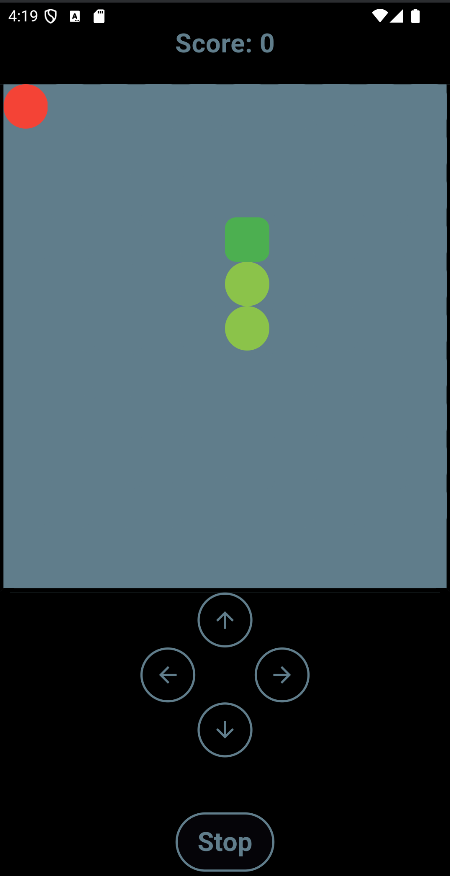

# Fnake
Snake game in Flutter.

## Overview

This game is a simple snake game made with Flutter. The game is played on a 10x10 grid. The main goal of this project is to learn Flutter and Dart.

## How to play

- Use the arrow keys to move the snake.
- The snake will grow when it eats the food.
- The game is over when the snake hits the wall or itself.
- Take plasure in playing the game.

## Screenshots

